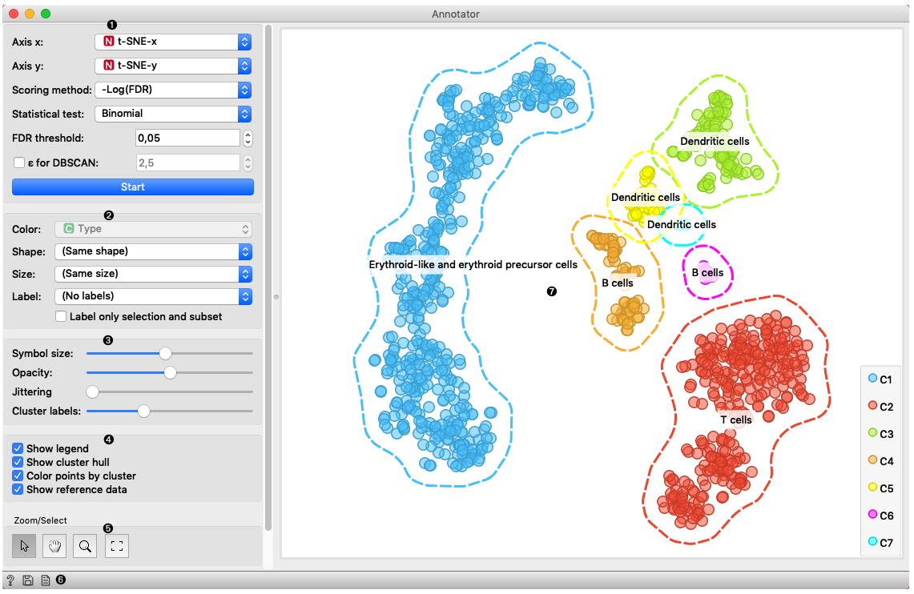
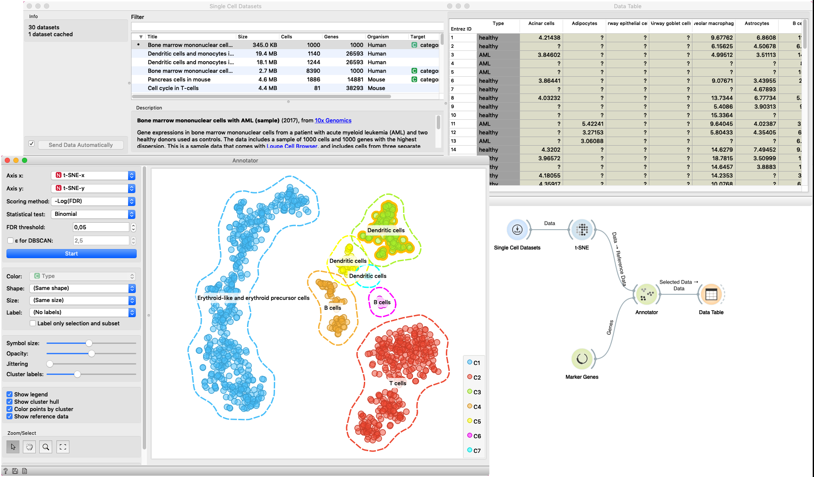
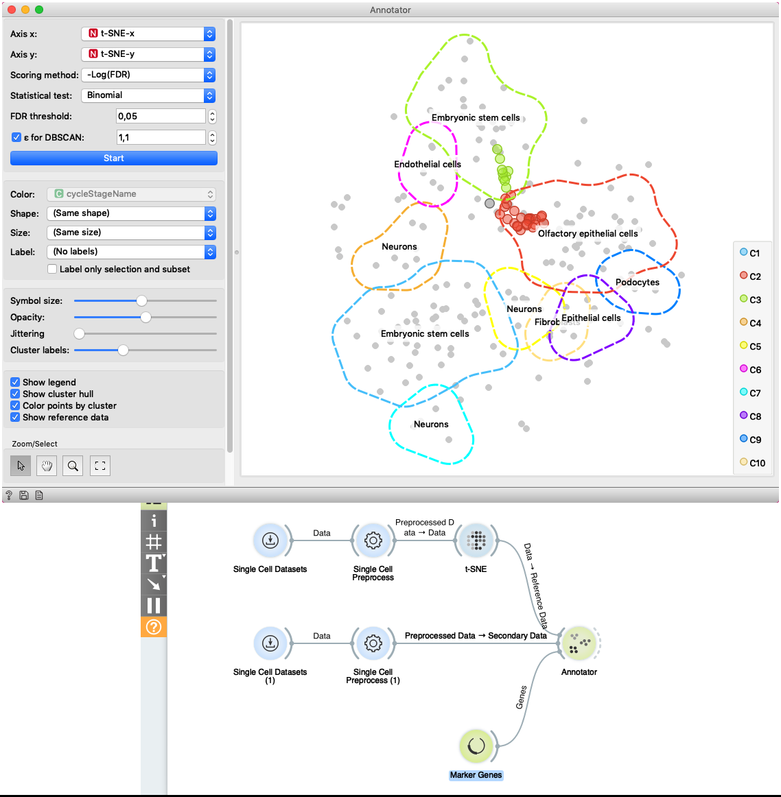

Annotator
=========

The widget provides an option to annotate cells with cell types based on
marker genes.

**Inputs**
- Reference Data: Data set with gene expression values.
- Secondary Data: Subset of instances (optional).
- Genes: Marker genes.

**Outputs**
- Selected Data: Instances selected from the plot.
- Data: Data with additional columns with annotations, clusters,
and projection

This widget receives gene expression data together with mapping to a
two-dimensional space and marker genes. It selects the most expressed
genes for each cell with the Mann-Whitney U test and computes the
p-value of each cell types for a cell based on the selected statistical
test. It visualizes groups of cells and for each group, it shows few
most present cell types.

1. This box contains settings for attribute selection and annotation:
    - *Axis X* and *Axis Y* let you select attributes you will show in
    the widget. By default t-SNE-x and t-SNE-y are selected which are
    transformations to lower dimensional space with a method named t-SNE.
    - *Scoring method* allows you to select the method to score the cell
    type affiliation to the cell. It has the following options:
        - *-Log(FDR)* - negative of the logarithm of an FDR value
        - *Marker expression* - the sum of expressions of genes typical
        for cell type.
        - *Marker expression %* - the proportion of genes typical for a
        cell type expressed in the cell.
    - *Statistical test* allow the user to select between the binomial and
    hypergeometric statistical test for computing the p-value.
    - *FDR threshold* sets the threshold for FDR value. Cell types that
    have an FDR value bellow this threshold are selected.
    - *&epsilon; for DBSCAN* regulates the &epsilon; parameter of a
    DBSCAN algorithm which forms groups in the visualization. When
    unchecked algorithm estimates this parameter itself.
    - *Start* run the assigning process. Whenever you change any
    parameter in this box rerun the process with this button.
2. Set the color of the displayed points (you will get colors for
discrete values and grey-scale points for continuous). Set label, shape,
and size to differentiate between points.
3. Set symbol size and opacity for all data points. Set
[jittering](https://en.wikipedia.org/wiki/Jitter) to prevent the dots
overlapping. Set the number of labels shown for a cluster.
4. Adjust *plot properties*:
   - *Show legend* displays a legend on the right. Click and drag the
   legend to move it.
   - *Show cluster hull* regulate whether the hull around cluster is
   present or not.
   - *Color points by cluster* colors the points with cluster specific
   color. When this option is checked setting color in box 2 is
   disabled.
   - *Show reference data* makes data from the
   *Reference data* input visible.
5. *Select, zoom, pan, and zoom to fit* are the options for exploring
the graph. The manual selection of data instances works as an
angular/square selection tool. Double click to move the projection.
Scroll in or out for zoom.
6. This group of buttons allows you to get help about the widget, save
the created image to your computer in a .svg or .png format, and create
the report.
7. The main view shows you data clustered data items. Each cluster
is surrounded by a hull and has assigned *Cell type* labels shown.

## Examples

In this example *Single Cell Datasets* widget provides *Bone marrow
mononuclear cells with AML (sample)* gene expression dataset and *t-SNE*
widget maps data into two-dimensional space. *Marker Genes* widget
provides markers
genes with cell types to the *Annotator* widget. The data table receives
the output of the Annotator widget and shows items selected in the plot.
The widget shows clustered cells projected to the two-dimensional plane.
Clusters labels show annotation with the most common label in the
cluster. This workflow can be accessed [here](https://download.biolab.si/download/files/workflows/orange/bioinformatics_annotator.ows).

The second example shows how to use *Secondary Data* input
of the widget. We load data with two *Single Cell Datasets* widgets.
First widget loads *Cell cycle in mESC (Fluidigm)* data which are used
as primary data. The second widget loads
*Cell cycle in mESC (QuartzSeq)* dataset for secondary data input.
After data are loaded, we normalize them with the
*Single Cell Preprocess* widget and map the reference data to
two-dimensional space with the t-SNE projection. Projecting the
secondary data is not required since the Annotator widget projects
them in the reference space. The Annotator window shows the mapping of
secondary data (colored points) to clusters generated on the reference
data.

