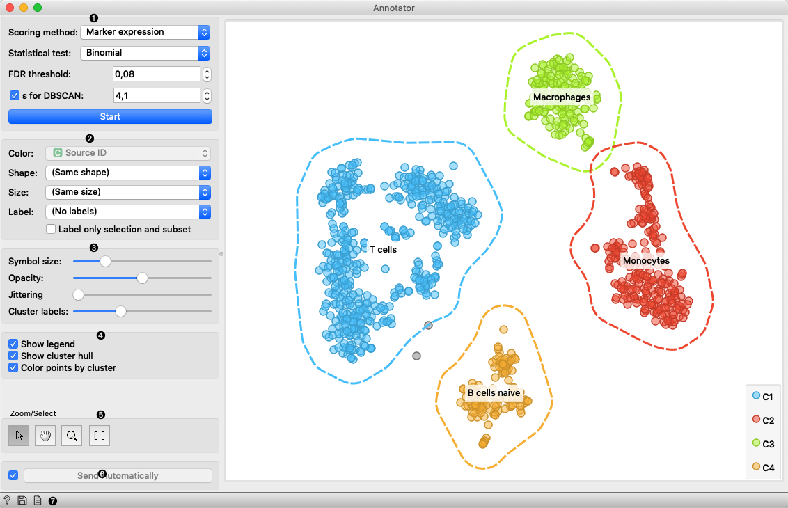
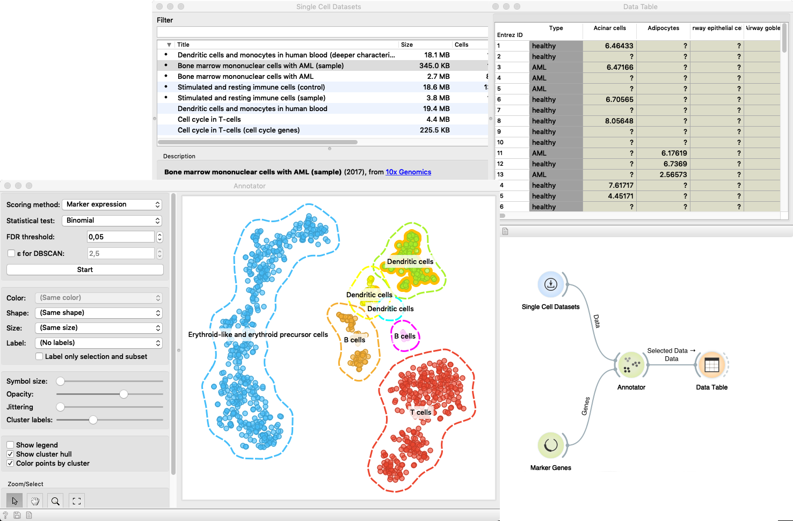

Annotator
=========

The widget provides an option to annotate cells with cell types based on
marker genes.

**Inputs**
- Data: Data set with gene expression values.
- Data Subset: Subset of instances (optional).
- Genes: Marker genes.
- Projector: Projector that project data in two dimensions (optional).
Default is tSNE.

**Outputs**
- Selected Data: Instances selected from the plot.
- Data: Data with additional columns with annotations, clusters,
and projection

This widget receives gene expression data and marker genes. It selects
the most expressed genes for each cell with the Mann-Whitney U test and
computes the p-value of each cell types for a cell based on the selected
statistical test. It visualizes groups of cells projected to the lower
dimensional space with a projector (default selection is tSNE). For
each group, it shows a few most present cell types.

1. This box contains settings specific for annotation:
    - *Scoring method* allows you to select the method to score the cell
    type affiliation to the cell. It has the following options:
        - *-Log(FDR)* - negative of the logarithm of an FDR value
        - *Marker expression* - the sum of expressions of genes typical
        for cell type.
        - *Marker expression %* - the proportion of genes typical for a
        cell type expressed in the cell.
    - *Statistical test* allow the user to select between the binomial and
    hypergeometric statistical test for computing the p-value.
    - *FDR threshold* sets the threshold for FDR value. Cell types that
    have an FDR value bellow this threshold are selected.
    - *&epsilon; for DBSCAN* regulates the &epsilon; parameter of a
    DBSCAN algorithm which forms groups in the visualization. When
    unchecked algorithm estimates this parameter itself.
    - *Start* run the assigning process. Whenever you change any
    parameter in this box rerun the process with this button.
2. Set the color of the displayed points (you will get colors for
discrete values and grey-scale points for continuous). Set label, shape,
and size to differentiate between points.
3. Set symbol size and opacity for all data points. Set
[jittering](https://en.wikipedia.org/wiki/Jitter) to prevent the dots
overlapping. Set the number of labels shown for a cluster.
4. Adjust *plot properties*:
   - *Show legend* displays a legend on the right. Click and drag the
   legend to move it.
   - *Show cluster hull* regulate whether the hull around cluster is
   present or not.
   - *Color points by cluster* colors the points with cluster specific
   color. When this option is checked setting color in box 2 is
   disabled.
5. *Select, zoom, pan, and zoom to fit* are the options for exploring
the graph. The manual selection of data instances works as an
angular/square selection tool. Double click to move the projection.
Scroll in or out for zoom.
6. If *Send automatically* is ticked, changes are communicated
automatically. Alternatively, press *Send*.
7. This group of buttons allows you to get help about the widget, save the
created image to your computer in a .svg or .png format, and create
the report.

## Example

In this example *Single Cell Datasets* widget provides *Bone marrow
mononuclear cells with AML (sample)* gene expression dataset to the
input of the Annotator widget. *Marker Genes* widget provides markers
genes with cell types to *Annotator* widget. The output of the Annotator
widget is connected to a data table where items that are selected in
the plot of the Annotator widget are present.

The widget shows cells projected to the 2D plane that are clustered.
Clusters have annotation with the most common label in the cluster.

 
