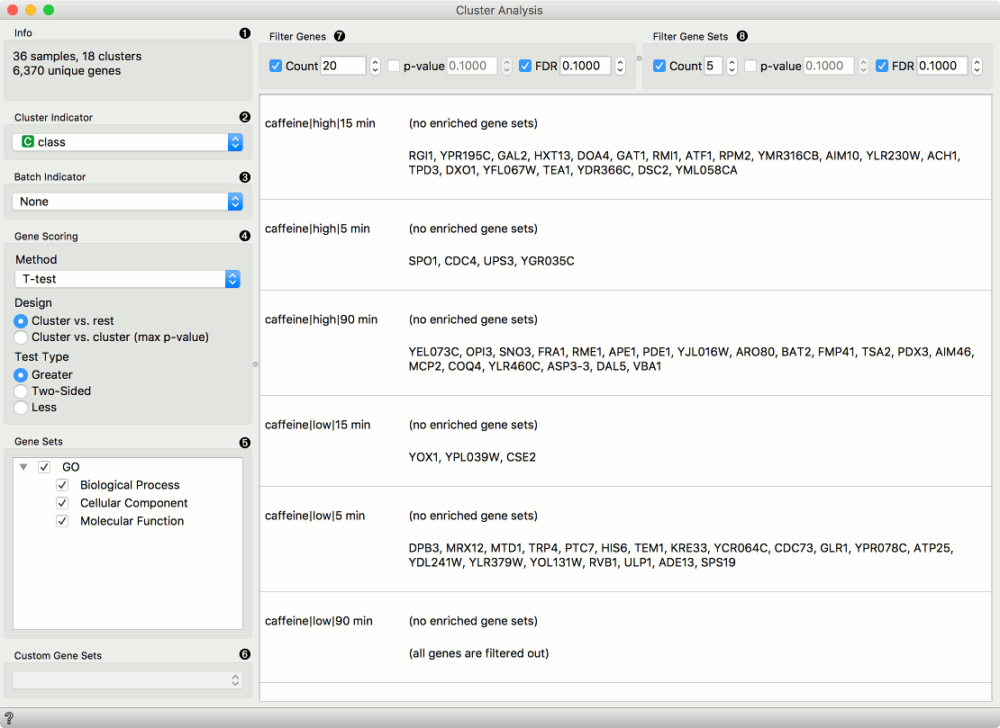

Cluster Analysis
================

Display differentially expressed genes that characterize the cluster.

**Inputs**
- Data: Data set.
- Custom Gene Sets: Genes to compare.

**Outputs**
- Selected Data: Data selected in the widget.

**Cluster Analysis** widget displays differentially expressed genes that characterize the cluster, and corresponding gene terms that describe differentially expressed genes.

1. Information on the number of samples, clusters, and unique genes in the input data.
2. *Cluster Indicator*: From a list of categorical variables from the input data select the one that will be used for clustering.
3. *Batch Indicator*: Select the variable that defines the batches (if applicable) in the data.
4. Use the *Gene Scoring* section to configure the method, design, and the test type.
    - *Method*: Choose between T-test (parametric test of null hypothesis with [P-value](https://en.wikipedia.org/wiki/P-value) as criterium), [Mann-Whitney](https://en.wikipedia.org/wiki/Mann%E2%80%93Whitney_U_test) (non-parametric test of null hypothesis with P-value as criterium), or [Hypergeometric test](https://en.wikipedia.org/wiki/Hypergeometric_distribution#Hypergeometric_test) (for binary expression data).
    - *Design*: Choose between "Cluster vs. Cluster" or "Cluster vs. Rest" to compare gene expression within or between specific clusters.
    - *Test Type*: Choose between two-sided, greater, or lesser based on the direction of the hypothesis being tested.
5. *Gene Sets*: A list of available gene sets that can be selected for enrichment analysis. Select multiple gene sets by ticking the checkbox next to the gene set name.
6. *Custom Gene Sets*: The custom gene sets connected to the widget are displayed here.
7. *Filter Genes* by limiting the number of genes and setting thresholds for p-value and FDR.
8. *Filter Gene Sets* by limiting the number of gene sets and setting thresholds for p-value and FDR.

Example
-------

From the **GEO Data Sets** widget we select the [GDS360](https://pubmed.ncbi.nlm.nih.gov/15718313/) data set for gene expression in breast cancer core biopsies taken from patients found to be resistant (14 samples) or sensitive (10 samples) to docetaxel treatment. Next we feed the data to the **Cluster Analysis** widget and set our parameters and gene sets to compare. We set the thresholds to filter the results and connect the widget to the **t-SNE** widget to visualize the results and to the **Data Table** widget to inspect the results.

This workflow can be accessed [here](https://download.biolab.si/download/files/workflows/orange/bioinformatics_cluster_analysis.ows).