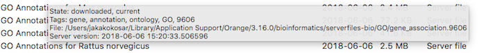

Databases Update
================

Updates local systems biology databases, like gene ontologies,
annotations, gene names, protein interaction networks, and similar.

Signals
-------

**Inputs**:

-   None

**Outputs**:

-   None

Description
-----------

With the bioinformatics add-on you can access several databases directly
from Orange. The widget can also be used to update and manage locally
stored databases.

1.  Find the desired database.
2.  A list of available databases described with data source, update
    availability, date of your last update and file size. A large
    **Update** button will be displayed next to the database that needs
    to be updated.
3.  **Update All** will update and **Download All** will download all
    of the available databases from the
    [serverfiles](https://orange.biolab.si/serverfiles-bio2/).
    **Cancel** will abort the action.

To get a more detailed information on the particular database hover on
its name.

