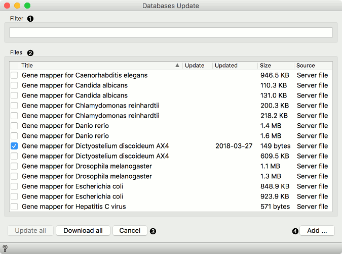

Databases Update
================

Updates local systems biology databases, like gene ontologies,
annotations, gene names, protein interaction networks, and similar.

**Inputs**
- None

**Outputs**
- None

With the bioinformatics add-on you can access several databases directly from Orange. The widget can also be used to update and manage locally stored databases. To get a more detailed information on the particular database hover on its name.

1. Find the desired database.
2. A list of available databases described with data source, update availability, date of your last update and file size. A large *Update* button will be displayed next to the database that needs to be updated.
3. *Update All* will update and *Download All* will download all of the available databases from the [serverfiles](https://orange.biolab.si/serverfiles-bio2/). *Cancel* will abort the action.
4. Add a data set from the local machine.

To add a new file to the database, select the domain and the organism of the data. Give the data set a name and, optionally, tag it with appropriate tags. Finally, use the *Select File* button to load the local file. Press OK to complete the process. The data will be stored in a cached folder **locally**. To see the full path to the data, hover on the data set name. 
