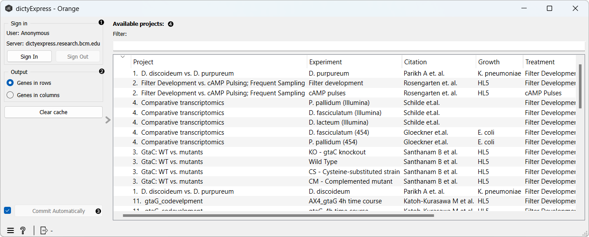
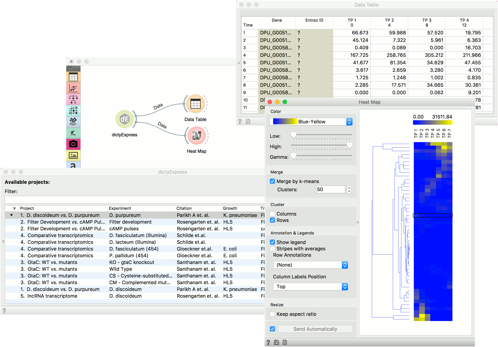

dictyExpress
============

Gives access to [dictyExpress](https://dictyexpress.research.bcm.edu)
databases.

**Inputs**
- None

**Outputs**
- Data: Selected experiment (time-course gene expression data).

**dictyExpress** widget gives a direct access to the [dictyExpress](https://dictyexpress.research.bcm.edu) database. It allows you to download the data from selected experiments in *Dictyostelium* by Baylor College of Medicine. The widget requires internet connection to work.

1. Log into the database to access personal files.
2. Define the output. Genes from experiments can be either in rows or in columns. To clear all locally cached dictyExpress data, press *Clear cache*.
3. If *Commit Automatically* is ticked, results will be automatically sent to the output. Alternatively, press *Commit*.
4. List of available experiments. Use *Filter* to find a particular experiment.

Example
-------

**dictyExpress** widget can be used to retrieve data from a database, just like **GEO Data Sets** and similar to the **File** widget. We have retrieved the *D. discoideum vs. D. purpureum* data and sent it to the output by pressing *Commit*. We have observed the data in a **Data Table** and in a **Heat Map**, where we used *Merge by k-means* and clustering by rows to find similar genes.

