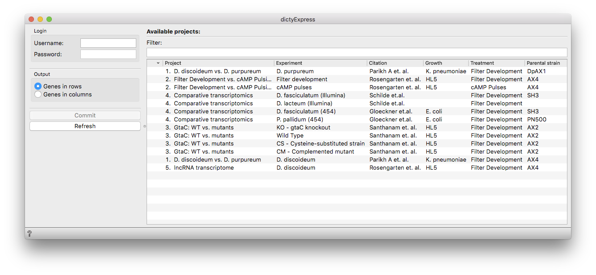
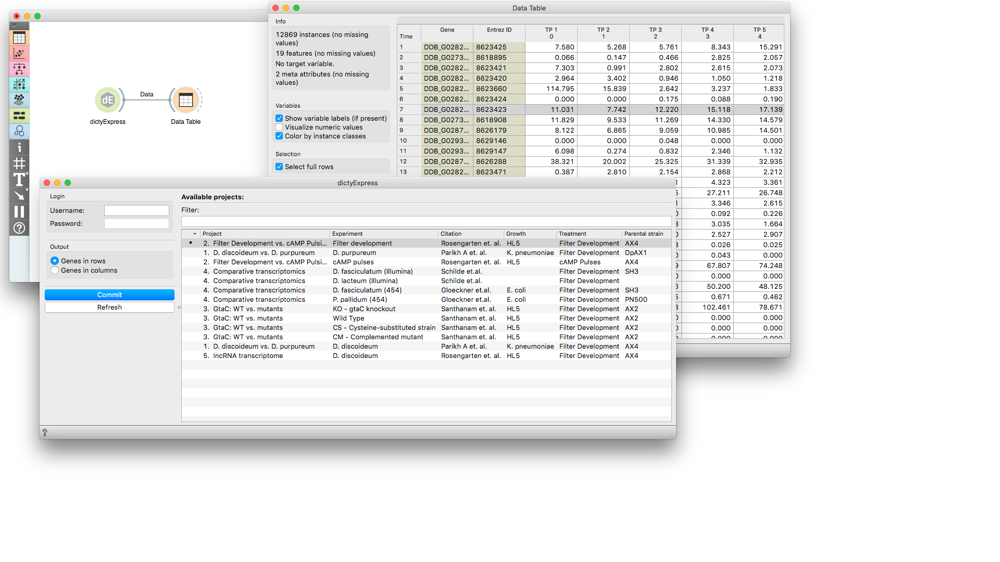

dictyExpress
============

Gives access to [dictyExpress](https://dictyexpress.research.bcm.edu)
databases.

Signals
-------

**Inputs**:

-   (None)

**Outputs**:

-   **Data**

    Selected experiment (time-course gene expression data).

Description
-----------

**dictyExpress** widget gives a direct access to
[dictyExpress](https://dictyexpress.research.bcm.edu) database. It
allows you to download the data from selected experiments.

Example
-------

