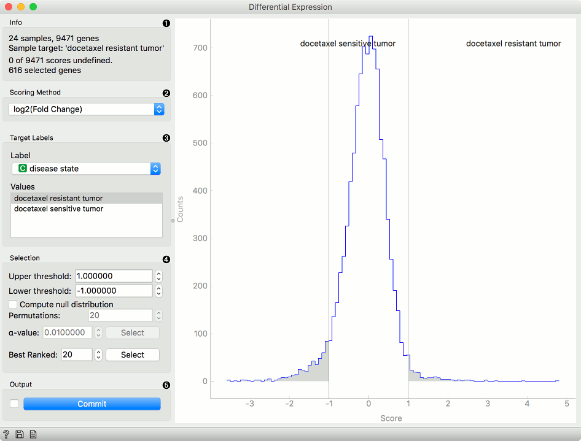
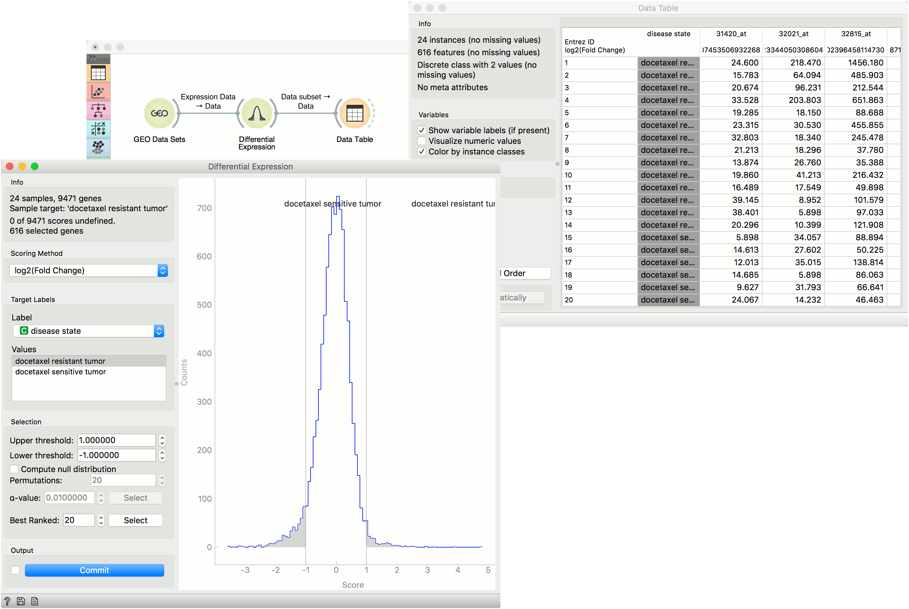

Differential Expression
=======================

Plots differential gene expression for selected experiments.

**Inputs**
- Data: Data set.

**Outputs**
- Data Subset: Differentially expressed genes.
- Remaining Data Subset: Genes that were not differentially expressed.
- Selected Genes: Genes from the select data with scores appended.

This widget plots a [differential gene
expression](http://www.ncbi.nlm.nih.gov/books/NBK10061/) graph for a
sample target. It takes gene expression data as an input (from
**dictyExpress**, **GEO Data Sets**, etc.) and outputs a selected data subset
(normally the most interesting genes).

1.  Information of the data input and output. The first line shows the
    number of samples and genes in the data set. The second line
    displays the selected sample target (read around which the graph is
    plotted). The third line shows the number of undefined genes (missing
    data) and the fourth the number of genes in the output.
2.  Select the plotting method in *Scoring method*:
    -   [Fold change](https://en.wikipedia.org/wiki/Fold_change): final to initial value ratio
    -   **log2 (fold change)**: binary logarithmic transformation of fold change values
    -   [T-test](https://en.wikipedia.org/wiki/Student%27s_t-test#Independent_two-sample_t-test): parametric test of null hypothesis
    -   **T-test (P-value)**: parametric test of null hypothesis with [P-value](https://en.wikipedia.org/wiki/P-value) as criterium
    -   [ANOVA](https://en.wikipedia.org/wiki/Analysis_of_variance): variance distribution
    -   **ANOVA (P-value)**: variance distribution with P-value as criterium
    -   [Signal to NoiseRatio](https://en.wikipedia.org/wiki/Signal-to-noise_ratio): biological signal to noise ratio
    -   [Mann-Whitney](https://en.wikipedia.org/wiki/Mann%E2%80%93Whitney_U_test): non-parametric test of null hypothesis with P-value as criterium
    -   [Hypergeometric test](https://en.wikipedia.org/wiki/Hypergeometric_distribution#Hypergeometric_test): for binary expression data.

3.  Select *Target Labels*. Labels depend on the attributes in the
    input. In *Values* you can change the sample target (default value
    is the first value on the list, alphabetically or numerically).
4.  *Selection* box controls the output data.
    -   By setting the *Lower threshold* and *Upper threshold* values you are outputting the data outside this interval (the most interesting expression levels). You can also manually place the threshold lines by dragging left or right in the plot.
    -   If you click *Compute null distribution* box, the widget will calculate null distribution and display it in the plot. *Permutations* field allows you to set the precision of null distribution (the more permutations the more precise the distribution), while [alpha-value](https://en.wikipedia.org/wiki/Type_I_and_type_II_errors#Type_I_error) will be the allowed probability of false positives. Press *Select* to output this data.
    -   The final option is to set the number of best ranked genes and output them with *Select*.

5.  When *Auto commit is on* is ticked, the widget will automatically
    apply the changes. Alternatively press *Commit*. If the *Add gene
    scores to output* is ticked, the widget will append an additional
    column with gene scores to the data.

Example
-------

From the GEO Data Sets widget, we selected *Breast cancer and docetaxel treatment* (GDS360) with 14 treatment resistant and 10 treatment sensitive tumors. Then we used the **Differential Expression** widget to select the most interesting genes. We left the upper and lower threshold at default (1 and -1) and output the data. Then we observed the selected data subset in a **Data Table**. The table shows selected genes with an additional gene score label.

A workflow that implements this widget can be accessed [here](https://download.biolab.si/download/files/workflows/orange/bioinformatics_homologs.ows).
