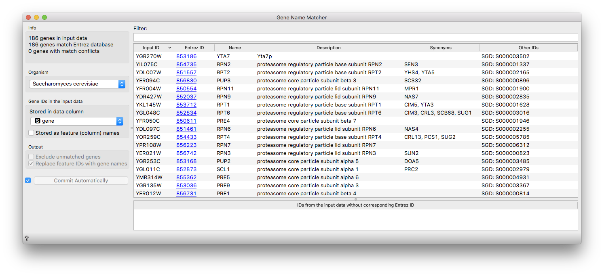
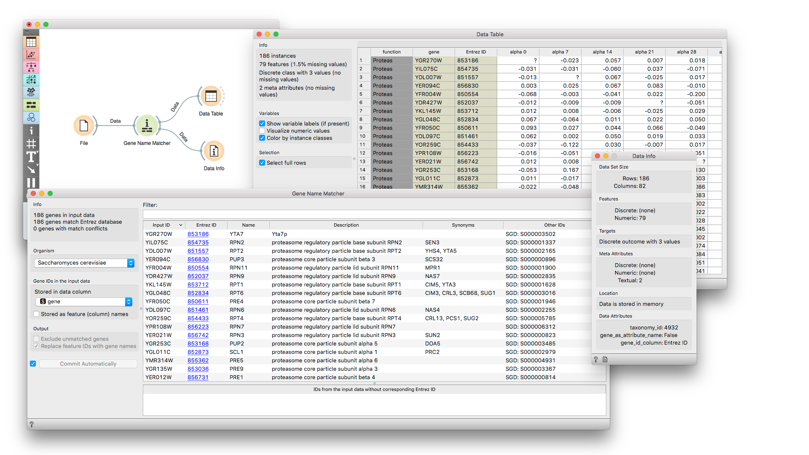

Gene Name Matcher
=================

Match input gene ID's with corresponding Entrez ID's.

Signals
-------

**Inputs**:

-   **Data**

    Data set.

**Outputs**:

-   **Data**

    Instances with meta data that the user has manually selected in the
    widget.

-   **Genes**

    All genes from the input with included gene info summary and matcher
    result.

Description
-----------

To work with widgets in the bioinformatics add-on data sets must be
properly annotated. We need to specify:
- Location of genes in a table (rows, columns)
- ID from the [NCBI Gene database](http://www.ncbi.nlm.nih.gov/gene) (Entrez ID)
- Organism (Taxonomy ID)

Gene Name Matcher is a useful widget that presents information on the
genes from the [NCBI Gene database](http://www.ncbi.nlm.nih.gov/gene) and
outputs annotated data table.
You can also select a subset and feed it  to other widgets.
By clicking on the gene Entrez ID in the list, you will be taken to the
NCBI site with the information on the gene.

Example
-------

Below we first load brown-selected (from documentation data sets) and
feed our data to the Gene Name Matcher widget. We can observe gene info
provided from NCBI Gene database. Entrez ID column is included as a
meta attribute and data table is properly annotated
(see *Data Attributes* section in *Data Info* widget).

