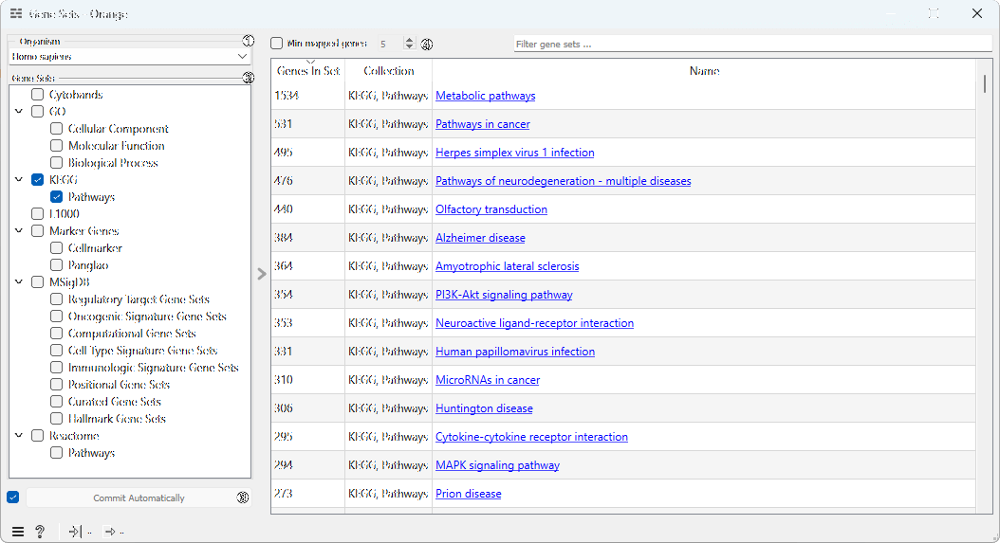
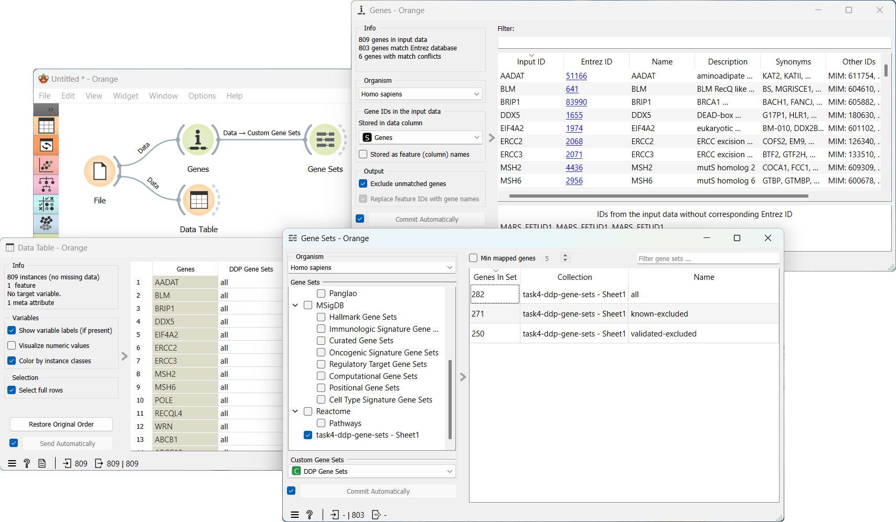
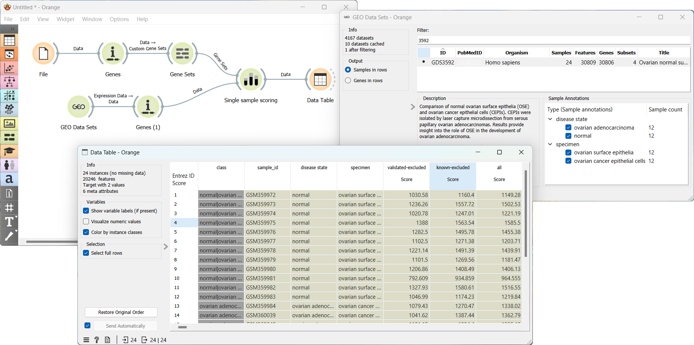

Gene Sets
=================

Lists of genes associated with specific biological function.

**Inputs**
- Data: Data set.
- Custom Gene Sets: Genes to compare.

**Outputs**
- Data: Instances with gene metadata within the selected gene sets.
- Gene Sets: Selected gene sets for utilization in other widgets (e.g., Single Sample Scoring).

Gene sets are lists of genes associated with a specific biological function. The **Gene Sets** widget allows you to select gene sets from multiple databases, including the [MSigDB](http://software.broadinstitute.org/gsea/msigdb), [Gene Ontology](http://geneontology.org/), [KEGG](https://www.genome.jp/kegg/), and [Reactome](https://reactome.org/) databases, or to create your own custom gene sets. You can also select gene sets and feed it to other widgets.

Data is preprocessed in Orange readable format and it is hosted [here.](http://download.biolab.si/datasets/bioinformatics/gene_sets/)

1. Select the *Organism*.
2. *Gene Sets*: A list of available gene sets. Select multiple gene sets by ticking the checkbox next to the gene set name. If custom gene sets were uploaded, they will appear here.
3. If *Commit Automatically* is ticked, results will be automatically sent to the output. Alternatively, press *Commit*.
4. Filter the results by limiting the number of mapped genes and searching for specific gene sets.

Example
-------

To create a custom gene set, we start by importing an Excel table that includes 284 human homologs of DNA "damage-up" proteins (DDPs) identified in *E.coli*. These DDPs are categorized into three gene sets: All DDPs, DDPs with known cancer drivers excluded, and validated DDPs recognized as genuine DNA damage instigators in human cells [(Xia et al.)](https://www.ncbi.nlm.nih.gov/pmc/articles/PMC6344048/). We accomplish this by utilizing the **File** widget. Next, we pass this data to the **Genes** widget for gene annotation, and then to the **Gene Sets** widget for custom gene set creation. Within the **Gene Sets** widget, we can select our file from the drop-down menu in the *Custom Gene Sets* section to generate the desired gene set. This workflow can be accessed [here](https://download.biolab.si/download/files/workflows/orange/bioinformatics_gene_sets.ows).

Next, we load the [*GDS3592*](https://pubmed.ncbi.nlm.nih.gov/20040092/) data set from the **GEO Data Sets** widget. This is a comparison of gene expressions in 12 normal ovarian surface epithelia and 12 ovarian cancer epithelial cells. To annotate the genes, we utilize the **Genes** widget. Once the genes are annotated, we connect both the **Genes** and **Gene Sets** (with our custom gene set selected) widgets to the **Single Sample Scoring** widget. Finally, we use **Data Table** widget to observe the enrichment scores associated with the selected gene sets.

