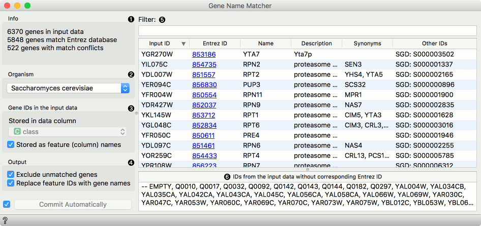
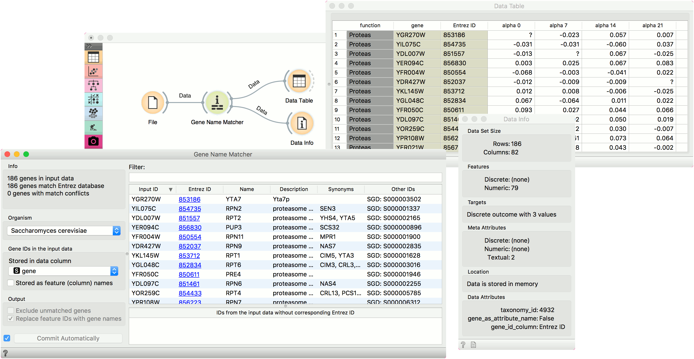

Genes
=================

Match input gene ID's with corresponding Entrez ID's.

**Inputs**
- Data: Data set.

**Outputs**
- Data: Instances with meta data that the user has manually selected in the widget.
- Genes: All genes from the input with included gene info summary and matcher result.

To work with widgets in the bioinformatics add-on data sets must be
properly annotated. We need to specify:
- Location of genes in a table (rows, columns)
- ID from the [NCBI Gene database](http://www.ncbi.nlm.nih.gov/gene) (Entrez ID)
- Organism (Taxonomy ID)

Genes is a useful widget that presents information on the
genes from the [NCBI Gene database](http://www.ncbi.nlm.nih.gov/gene) and
outputs annotated data table.
You can also select a subset and feed it  to other widgets.
By clicking on the gene Entrez ID in the list, you will be taken to the
NCBI site with the information on the gene.

Example
-------

First we load *brown-selected.tab* (from *Browse documentation data sets*) with the **File** widget and feed our data to the Genes widget. Orange recognized the organism correctly, but we have to tell it where our gene labels are. To do this, we tick off *Stored as feature (column) name* and select *gene* attribute from the list. Then we can observe gene info provided from the NCBI Gene database. In the **Data Table** we can see the Entrez ID column included as a meta attribute. The data is also properly annotated (see *Data Attributes* section in **Data Info** widget).

A workflow that implements this widget can be accessed [here](https://download.biolab.si/download/files/workflows/orange/bioinformatics_gene_sets.ows).