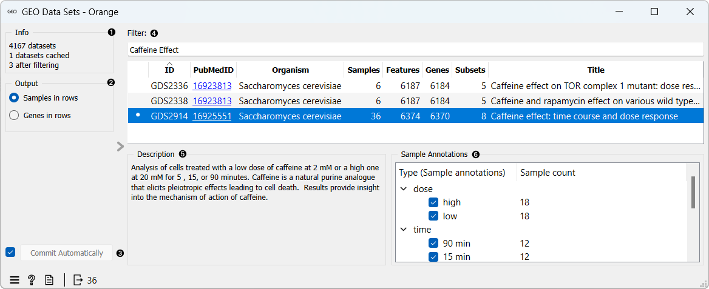
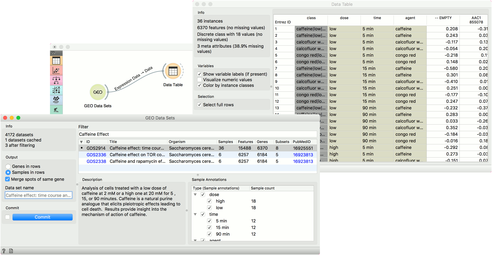

GEO Data Sets
=============

Provides access to data sets from gene expression omnibus [GEO
DataSets](http://www.ncbi.nlm.nih.gov/gds).

**Inputs**
- None

**Outputs**
- Expression data: Data set selected in the widget with genes or samples in rows.

[GEO DataSets](http://www.ncbi.nlm.nih.gov/gds) is a database of gene
expression curated profiles maintained by
[NCBI](http://www.ncbi.nlm.nih.gov/) and included in the [Gene
Expression Omnibus](http://www.ncbi.nlm.nih.gov/geo/info/datasets.html).
This Orange widget provides access to all its data sets and outputs a
data set selected for further processing. For convenience, each
dowloaded data set is stored locally.

1.  Information on the GEO data set collection. Cached data sets are the
    ones currently stored on the computer.
2.  Output features. If *Samples in rows* is selected, genes (or spots)
    will be used as attributes. Alternatively samples will be used as
    attributes. *Merge spots of same gene* averages measures of the same
    gene. Finally, in the *Data set name* you can rename the output
    data. GEO title will be used as a default name.
3.  If *Auto commit is on*, then the selected data set will be
    automatically communicated to other widgets. Alternatively, click
    *Commit*.
4.  *Filter* allows you to search for the data set. Below you see a list
    of GEO data sets with an ID number (link to the NCBI Data Set
    Browser), title, organism used in the experiment, number of samples,
    features, genes, subsets and a reference number for the PubMed
    journal (link to the article abstract).
5.  Short description of the experiment from which the data set is
    sourced.
6.  Select which *Sample Annotations* will be used in the output.

Example
-------

**GEO Data Sets** is similar to the **File** widget, since it is used to load the data. In the example below we selected *Caffeine effect: time course and dose response* dataset from the GEO data base. Do not forget to press *Commit* to output the data. We can inspect the data in *Data Table*.

