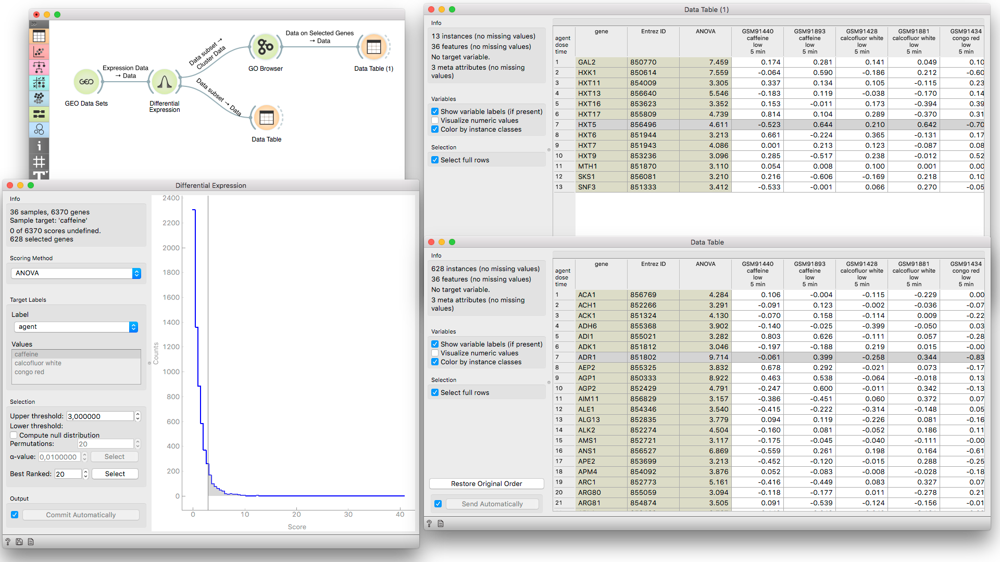

GO Browser
==========

.. figure:: icons/go-browser.png

Provides access to Gene Ontology database.

Signals
-------

**Inputs**:

- **Cluster Data**

  Data on clustered genes.

- **Reference Data**

  Data with genes for the reference set (optional).

**Outputs**:

- **Data on Selected Genes**

  Data on genes from the selected GO node.

- **Enrichment Report**

  Data on GO enrichment analysis.

Description
-----------

**GO Browser** widget provides access to `Gene Ontology database <http://geneontology.org/>`_.
Gene Ontology (GO) classifies genes and gene products to terms organized in a graph structure called an ontology.
The widget takes any data on genes as an input (it is best to input statistically significant genes,
for example from the output of the **Differential Expression** widget) and shows a ranked list of GO terms with
p-values. This is a great tool for finding biological processes that are over- or under-represented in a 
particular gene set. The user can filter input data by selecting terms in a list.

.. figure:: images/go_browser/go_browser_stamped.png

**INPUT tab**

1. Information on the input data set. *Ontology/Annotation Info* reports the current status of the GO database.

2. Select organism for the GO term analysis.

3. Use this attribute to extract gene names for the input data. You can use attribute names as gene names and 
   adjust gene matching in the *Gene matcher settings* box.

4. Select the reference. You can either have the *entire genome* as reference or a *reference set* from the input.

5. Select the ontology where you want to calculate the enrichment. There are three *Aspect* options:
   - `Biological process <http://geneontology.org/page/biological-process-ontology-guidelines>`_

   - `Cellular component <http://geneontology.org/page/cellular-component-ontology-guidelines)>`_

   - `Molecular function <http://geneontology.org/page/molecular-function-ontology-guidelines>`_

6. A ranked tree (upper pane) and list (lower pane) of GO terms for the selected aspect:
   - **GO term**

   - **Cluster**: number of genes from the input that are also annotated to a particular GO term (and its proportion in all the genes from that term).

   - **Reference**: number of genes that are annotated to a particular GO term (and its proportion in the entire genome).

   - **P-value**: probability of seeing as many or more genes at random. The closer the p-value is to zero, the more significant a particular GO term is. Value is written in `e notation <https://en.wikipedia.org/wiki/Scientific_notation#E_notation)>`_.

   - **FDR**: `false discovery rate <https://en.wikipedia.org/wiki/False_discovery_rate>`_ - a multiple testing correction that means a proportion of false discoveries among all discoveries up to that FDR value.

   - **Genes**: genes in a biological process.

   - `Enrichment <http://geneontology.org/page/go-enrichment-analysis>`_ level

.. figure:: images/go_browser/go_browser_tabs_stamped.png

**FILTER tab**

1. *Filter GO Term Nodes* by:
   - **Genes** is a minimal number of genes mapped to a term

   - **P-value** is a max term p-value

   - **FDR**: is a max term `false discovery rate <https://en.wikipedia.org/wiki/False_discovery_rate>`_

2. *Significance test* specifies distribution to use for null hypothesis:
   - `Binomial <https://en.wikipedia.org/wiki/Binomial_distribution>`_: use a binomial distribution

   - `Hypergeometric <https://en.wikipedia.org/wiki/Hypergeometric_distribution>`_: use a hypergeometric distribution

3. `Evidence codes in annotation <http://geneontology.org/page/guide-go-evidence-codes>`_ show how the annotation to a particular term is supported.

**SELECT tab**

4. *Annotated genes* outputs genes that are:
   - **Directly or Indirectly** annotated (direct and inherited annotations)

   - **Directly** annotated (inherited annotations won't be in the output)

5. *Output*:
   - **All selected genes**: outputs genes annotated to all selected GO terms

   - **Term-specific genes**: outputs genes that appear in only one of selected GO terms

   - **Common term genes**: outputs genes common to all selected GO terms

   - **Add GO Term as class**: adds GO terms as class attribute

Example
-------

In the example below we have used **GEO Data Sets** widget, in which we have selected 
*Caffeine effects: time course and dose response* data set, and connected it to a **Differential
Analysis**. Differential analysis allows us to select genes with the highest statistical relevance
(we used ANOVA scoring) and feed them to **GO Browser**. This widget lists four biological
processes for our selected genes. Say we are interested in finding out more about *monosaccharide transport*
as this term has a high enrichment rate. To learn more about which genes
are annotated to this GO term we view it in the **Data Table**, where we see all the genes
participating in this process listed.

