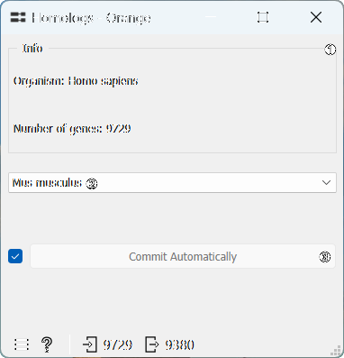
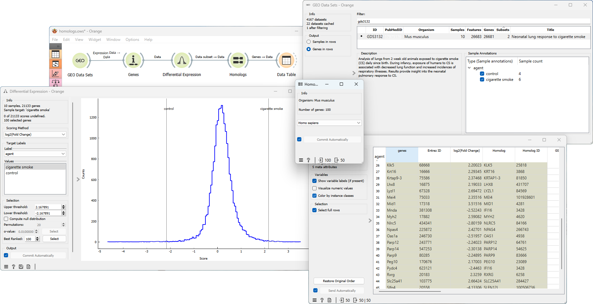

Homologs
============

Finds homologs to genes in the input data set.

**Inputs**
- Data: Input data set.

**Outputs**
- Genes: List of homologs.

The **Homologs** widget finds homologs to genes in the input data set for the selected organism. [Homologs](https://en.wikipedia.org/wiki/Sequence_homology) are genes or proteins that share a common ancestry, often found in different species, and may have similar functions or sequences. Studying homologs is useful because it provides insights into evolutionary relationships, gene function, drug discovery, and aids in comparative genomics and experimental design

1. Information on the organism and the number of genes in the input data.
2. Choose the organism for which you wish to identify homologs.
3. If *Commit Automatically* is ticked, results will be automatically sent to the output. Alternatively, press *Commit*.

Example
-------

From the **GEO Data Sets** widget we select the [GDS10](https://pubmed.ncbi.nlm.nih.gov/11827943/) data set for type 1 diabetes gene expression profiling in mice (*Mus musculus*). Next, we annotate the genes using the **Genes** widget. We then connect the **Genes** and **Homologs** widgets and select the organism of interest. The output of the **Homologs** widget is a list of homologs to the genes in the input data set. Next, we connect the **Homologs** widget to the **Data Table** widget. This allows us to efficiently inspect and work with information specifically related to homologous genes.

