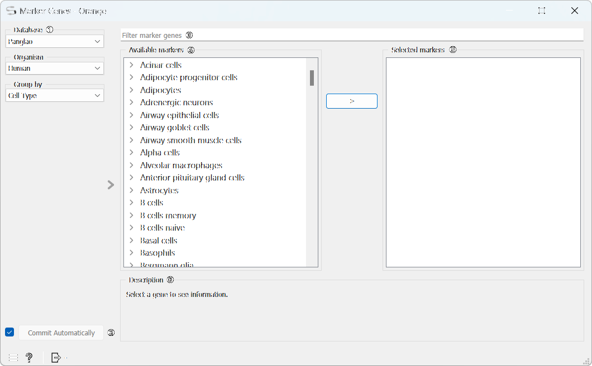
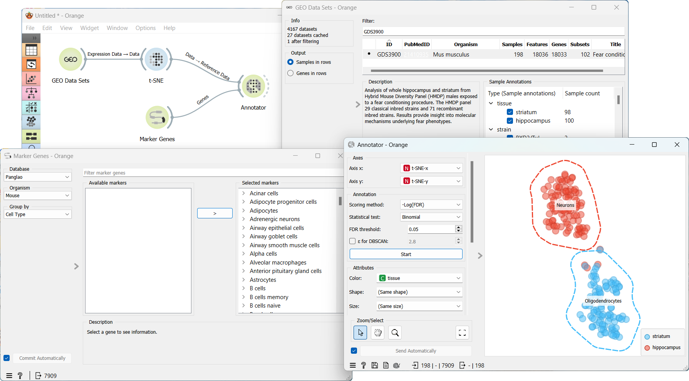

Marker Genes
============

Widget provides access to a public database of marker genes.

**Outputs**
- Genes

Database sources:

 - PanglaoDB

 	<cite>Oscar Franzén, Li-Ming Gan, Johan L M Björkegren, PanglaoDB: a web server for exploration of mouse and human single-cell RNA sequencing data, Database, Volume 2019, 2019, baz046, https://doi.org/10.1093/database/baz046</cite>
 
  
 
 - CellMarker
  
  	<cite>[CellMarker: a manually curated resource of cell markers in human and mouse.][1] Nucleic Acids Research. 2018.</cite>
 

Data is preprocessed in Orange readable format and it is hosted [here.][2] One can use [Databases update](databases_update.md)
widget to download (or update) files locally.

1.  Select the *Database*, *Organism*, and choose whether to group marker genes by *Cell Type* or *Function*. 
2.  *Filter marker genes* allows you to search for a particular marker gene.
3.  List of all groups of available markers. You can see the genes in each group by expanding it.
4.  Select marker genes by selecting *Available markers* and moving them to *Selected markers* by clicking the arrow in between. 
5.  For more details about a particular marker gene, simply click on it to view information in the *Description* panel.
6.  When *Commit automatically* is ticked, the widget will automatically apply the changes. Alternatively press *Commit*.
 
Example
-------

We can use the **Marker Genes** in a combination with many other widgets. For example, we can use it to annotate cell types in the **Annotator** widget. In order to do that, we first need to load the data. From **GEO Data Sets** widget we select the [GDS3900][3] data set *Fear conditioning effect on hybrid mouse diversity panel* and feed the data to the **t-SNE** widget. We add the **Marker Genes** widget to annotate the cell types, select *Mouse* as *Organism* and select all marker genes. Finally, we connect both widgets to the **Annotator** widget to visualize the results.

A workflow that implements this widget can be accessed [here](https://download.biolab.si/download/files/workflows/orange/bioinformatics_annotator.ows).

[1]:https://academic.oup.com/nar/article/47/D1/D721/5115823
[2]:http://download.biolab.si/datasets/bioinformatics/marker_genes/
[3]:https://pubmed.ncbi.nlm.nih.gov/21410935/