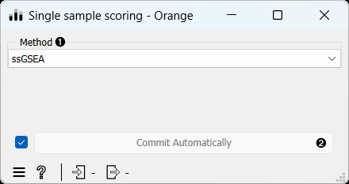
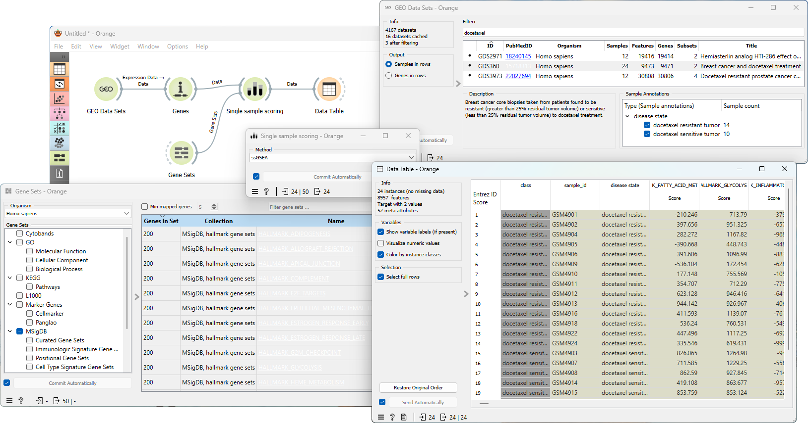

Single Sample Scoring
============

Scoring gene sets by single sample.

**Inputs**
- Data: Input data set.
- Custom Gene Sets: Gene sets to be used for scoring.

**Outputs**
- Data: Data set with enrichment scores corresponding to the selected gene sets.

The **single-sample** extension of Gene Set Enrichment Analysis ([ssGSEA](https://www.nature.com/articles/nature08460)) is a widely used method that assigns scores to gene sets based on individual sample gene overexpression. It calculates scores by summing the contributions of genes based on their rank in an ordered expression matrix, with high expression values positively impacting the score.

1.  Select the *Method* for scoring.
2.  When *Commit automatically* is ticked, the widget will automatically apply the changes. Alternatively press *Commit*.

Example
-------
From the GEO Data Sets widget, we selected *Breast cancer and docetaxel treatment* ([GDS360](https://pubmed.ncbi.nlm.nih.gov/15718313/)) data set with 14 treatment resistant and 10 treatment sensitive tumors. We annotated the genes using the **Genes** widget and selected the relevant gene sets using the **Gene Sets** widget. Finally, we used the **Single Sample Scoring** widget and the **Data Table** widget to observe the enrichment scores associated with the selected gene sets.

A workflow that implements this widget can be accessed [here](https://download.biolab.si/download/files/workflows/orange/bioinformatics_gene_sets.ows).
