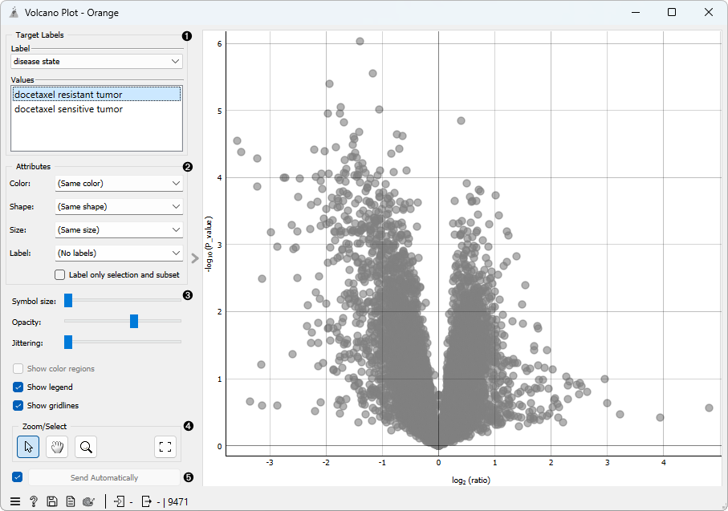
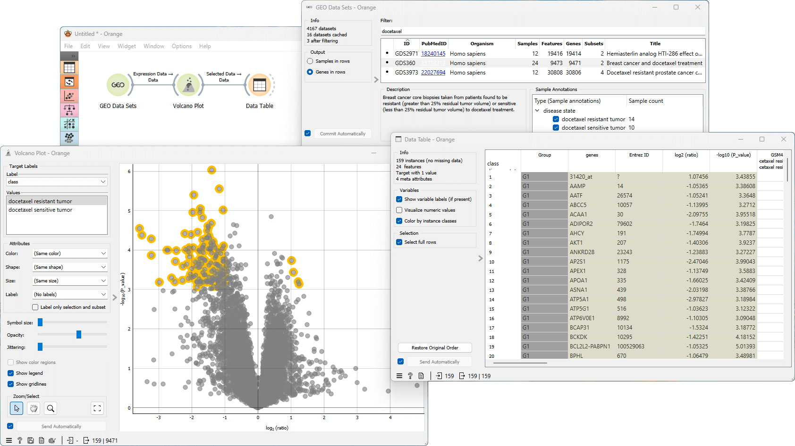

Volcano Plot
============

Plots significance versus fold-change for gene expression rates.

**Inputs**
- Data: Input data set.

**Outputs**
- Selected Data: Data subset.

[**Volcano plot**](https://en.wikipedia.org/wiki/Volcano_plot_(statistics)) is a graphical method for
visualizing changes in replicate data. The widget plots a binary logarithm of fold-change on the x-axis versus
[statistical significance](https://en.wikipedia.org/wiki/Statistical_significance)
(negative base 10 logarithm of p-value) on the y-axis.

**Volcano Plot** is useful for a quick visual identification of statistically significant
data (genes). Genes that are highly dysregulated are
farther to the left and right, while highly significant fold changes appear higher on the plot.
A combination of the two are those genes that are statistically significant.

1.  Select the target label in *Target labels*. Labels depend on the 
    attributes in the input.
    In *Values* change the sample target (default value is the
    first value on the list, alphabetically or numerically).
2.  In *Attributes* set the color of the displayed points. Set shape, size and label to differentiate between points. If *Label only selection and subset* is ticked, only selected and/or highlighted points will be labelled.
3.  Set symbol size and opacity for all data points. Set jittering to randomly disperse data points.
4.  Select, zoom, pan and zoom to fit are the options for exploring the graph. The manual selection of data instances works as an angular/square selection tool. Scroll in or out for zoom.
5.  If *Send automatically* is ticked, changes are communicated automatically. Alternatively, press *Send selection*.

Example
-------
From the GEO Data Sets widget, we select *Breast cancer and docetaxel treatment* (GDS360) with 14 treatment resistant and 10 treatment sensitive tumors. We select *Genes in rows* as output. Then we use the **Volcano plot** widget to select the most interesting genes. We observe the selected data subset in a **Data Table**. The table shows selected genes with the additional log2 (ratio) and -log10 (P_value) columns. To visualize the difference in expression of each selected gene, we first transpose the data using **Transpose** widget and then use the **Box Plot** widget. This workflow can be accessed [here](https://download.biolab.si/download/files/workflows/orange/bioinformatics_volcano_plot.ows).

